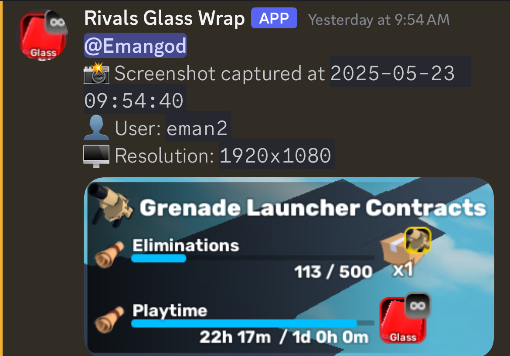

# SStoWebhook
## What does it do?
Well its quite simple just like on windows when you go to take a screenshot you'll be prompted with a way to click and drag to select a area then that will be sent to a discord web hook on a repeated interval

## What it looks like


## Run in cmd before runing
```
pip install pyautogui
pip install tkinter
pip install getpass
```
